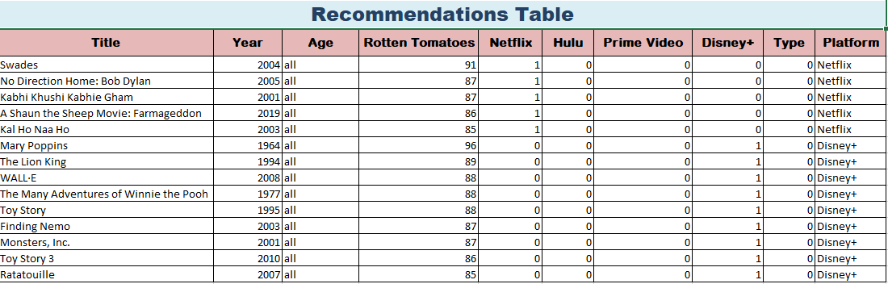
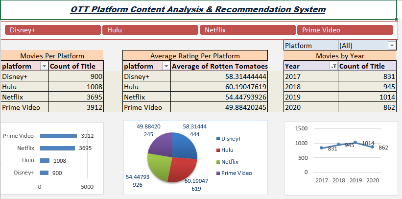

# 🎬 OTT Analytics Dashboard using Excel

## 📌 Project Description
This project uses Microsoft Excel to analyze data from multiple OTT platforms (Netflix, Hulu, Prime Video, Disney+) using pivot tables, charts, and a visual dashboard. It helps users and businesses:

- Identify top-rated movies by platform
- Analyze movie releases over time
- Recommend quality family-friendly movies

## 📊 Features
- Pivot Tables for summaries (platform, rating, year)
- Visual Charts (bar, column, line)
- Interactive Dashboard with slicers
- Filtered Recommendation Table (RT ≥ 85 & Age = all or 13+)
- Automated Refresh Macro

## 🗂 Files Included
| File Name | Description |
|-----------|-------------|
| `OTT_Analytics_Cleaned.xlsx` | Main dashboard and pivot file |
| `Recommendations_Sheet.xlsx` | Filtered top movies |
| `Screenshots/` | Dashboard and chart images |
| `README.md` | Documentation of the project |

##  Tools Used
- Microsoft Excel
- Pivot Tables
- Charts (Bar, Line, Column)
- Slicers

## Problem Statement
> Analyze and visualize data from multiple streaming platforms to identify where top-rated movies are available, understand content distribution over time, and help users find the best platform for quality content.

## Insights
- Netflix has the highest volume of movies
- Prime Video has top-rated titles (avg. RT rating)
- Content production spiked around 2018
- Family-friendly movies with RT ≥ 85 are rare and valuable
- 

## 🖼 Dashboard Preview

##  Author
**Arshiya Ruksar**  
BTech Student | Data Analytics Enthusiast  
